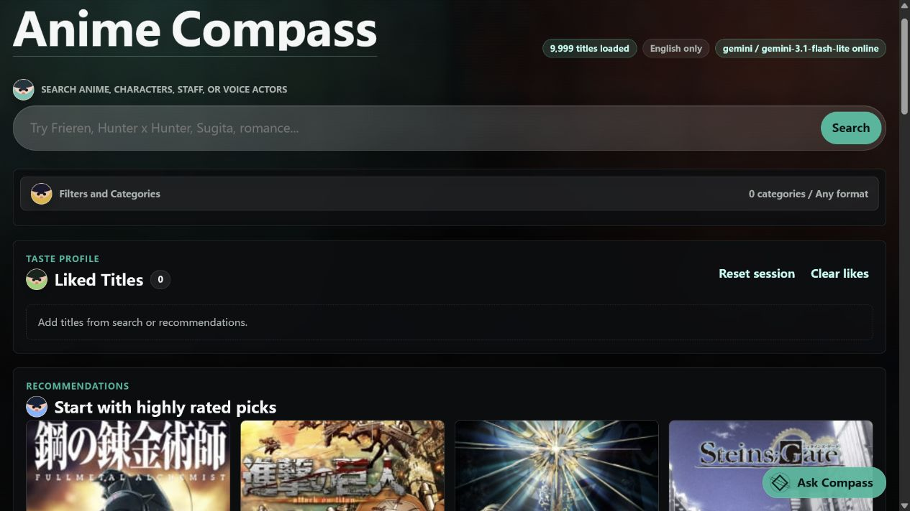
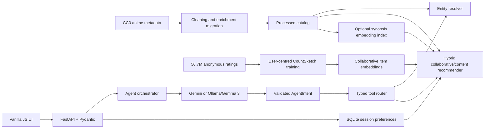

# Anime Compass

Anime Compass is a local-first, agentic anime discovery app backed by an 18,064-title catalog. It combines strict entity and metadata filters, an explainable hybrid recommender trained on 56.7 million anonymous ratings, optional semantic embeddings, and anonymous session feedback behind FastAPI and a responsive vanilla JavaScript interface.



## What It Demonstrates

- Provider-agnostic Agent orchestration with Gemini and local Ollama/Gemma adapters
- JSON-schema-constrained intent parsing and typed, deterministic tool routing
- Exact catalog joins for characters, voice actors, staff, studios, producers, directors, creators, themes, and demographics
- Hard constraints applied before ranking, with relationship evidence returned per result
- Reconstructable late fusion over collaborative item embeddings, TF-IDF, LSA, optional pretrained embeddings, metadata, creators, quality, novelty, and session signals
- Paginated hybrid search, exact studio/format filters, include/exclude constraints, explicit ranking, and preference-aware recommendations
- Reproducible offline evaluation, tests, CI, Docker, and a CC0 data pipeline

## Architecture



The LLM understands language and verbalizes verified results. It never selects final catalog records directly.

## Agent Tool Flow

`AgentIntent` distinguishes six operations:

| Intent | Backend behavior |
|---|---|
| `search` | Relevance-oriented catalog/entity lookup |
| `rank_catalog` | Deterministic filtering and explicit sorting, independent of session taste |
| `recommend` | Preference-aware hybrid content recommendation |
| `details` | Catalog-grounded, spoiler-light anime introduction |
| `update_preferences` | Anonymous session feedback update |
| `conversation` | No catalog tool execution |

```text
user message
  -> Gemini/Ollama returns structured AgentIntent
  -> Pydantic validates and normalizes every field
  -> backend derives an allowlisted tool plan
  -> backend resolves entities and executes catalog joins/filters
  -> tool trace is validated against its typed contract
  -> provider may verbalize only the verified tool payload
  -> backend rejects ungrounded title lists
```

Available tools are `search_anime`, `search_entities`, `resolve_entity`, `rank_catalog`, `recommend_anime`, `get_anime_details`, and `update_session_preferences`.

For a request such as "recommend 7 anime with Yoshitsugu Matsuoka," the backend resolves the voice-actor record, joins its related anime IDs, filters to that verified subset, and only then ranks. Each result includes `matched_voice_actors`, character, language, entity ID, and relationship evidence.

## Recommendation Model

The model is a **multi-channel hybrid collaborative/content recommender with session-based personalization**:

| Channel | Default weight | Source |
|---|---:|---|
| Metadata TF-IDF | 0.16 | genres, format, studios, people, catalog labels |
| Synopsis TF-IDF | 0.10 | synopsis terms and story themes |
| LSA | 0.04 | deterministic truncated decomposition of content features |
| Pretrained semantic | 0.14 | optional normalized `all-MiniLM-L6-v2` vectors |
| Hashed dense text | 0.08 | local token, character n-gram, and bigram features |
| Creator similarity | 0.05 | studios and selected staff roles |
| Collaborative | 0.22 | user-centred item vectors from completed-title ratings |
| Quality prior | 0.13 | Bayesian rating mean, aggregate score, members, and popularity |
| Session signal | 0.05 | anonymous likes, dislikes, watched titles, and preferences |
| Novelty | 0.03 | mainstream or less-famous preference |

Weights are renormalized across channels that are active for a request. Hard filters and required entity relationships are applied first.

```text
effective_weight[c] = configured_weight[c] / sum(configured weights of active channels)
pre_diversity_score = sum(effective_weight[c] * normalized_score[c])
final_score = pre_diversity_score + diversity_adjustment
```

Every API recommendation exposes raw channel scores, configured and effective weights, weighted contributions, and the final diversity adjustment. The collaborative artifact uses randomized user-dimension projections to approximate adjusted-cosine item similarity; it is not mislabeled content LSA or matrix-factorization SVD.

### Collaborative Artifact

`rating_complete.csv` contains only completed-and-rated titles. Training user-centres each rating vector and projects the sparse user dimension into three independently signed CountSketch blocks. The web process loads only normalized item vectors and Bayesian item statistics, not the 818 MB interaction file.

```powershell
python scripts/build_collaborative_model.py
```

The generated artifact contains 18,064 aligned IDs, 384-dimensional vectors, and statistics learned from 56,726,861 in-scope ratings across 310,059 users. Startup validates version, shape, finite values, score ranges, unique IDs, and catalog overlap.

### Semantic Artifact

The optional semantic provider is `sentence-transformers/all-MiniLM-L6-v2`, pinned to revision `1110a243fdf4706b3f48f1d95db1a4f5529b4d41`. A semantic artifact stores normalized 384-dimensional vectors plus model, preprocessing, ID-map, and catalog-checksum metadata. Startup rejects stale or incompatible artifacts rather than silently using them.

Build or verify it with:

```powershell
python scripts/build_semantic_embeddings.py --force
python scripts/build_semantic_embeddings.py --verify-only --offline
```

## Evaluation

There are two deliberately separate evaluation layers:

- The existing seven-case benchmark protects catalog constraints, agent routing, and qualitative recommendation
  behavior.
- The personalized offline benchmark uses a deterministic, leakage-safe per-user positive holdout over the
  anonymous rating archive. It compares train-only popularity, CountSketch CF, LightFM-ID, and LightFM-Hybrid on
  identical users with NDCG/Recall/HR/MRR, coverage/novelty/bias/diversity, activity and long-tail diagnostics,
  threshold sensitivity, paired bootstrap intervals, and engineering costs.

The personalized methodology, commands, artifacts, and limitations are documented in
[data/evaluation/personalized/README.md](data/evaluation/personalized/README.md). LightFM remains an offline
challenger and is not wired into the production hybrid.

### Personalized LightFM challenger

The primary result is a deterministic, representative 1,000-user sample from the full-data train-only split
(`rating >= 8`, seed 42). The complete decision also uses 100 users per activity stratum, a quota of 100 qualifying
users per item-popularity stratum, and fixed-configuration threshold-7/8/9 sensitivity runs.

| Model | NDCG@10 | Recall@10 | HR@10 | Coverage | Novelty | ILD | p50 rank latency |
|---|---:|---:|---:|---:|---:|---:|---:|
| Popularity | 0.1023 | 0.0881 | 0.4420 | 0.0059 | 8.424 | 0.8222 | 0.22 ms |
| CountSketch CF | 0.1534 | 0.1408 | 0.5840 | **0.0775** | **9.639** | **0.8264** | 7.28 ms |
| LightFM-ID | **0.1833** | **0.1589** | **0.6430** | 0.0380 | 9.152 | 0.7990 | 1.17 ms |
| LightFM-Hybrid | 0.1747 | 0.1483 | 0.6250 | 0.0421 | 9.308 | 0.7770 | 1.16 ms |

LightFM-ID improves NDCG@10 over CountSketch by 2.99 percentage points (+19.51%; paired 95% CI
`[+1.71, +4.28]` points). It is **not promoted**: catalog coverage is roughly halved, sparse-user and tail-item
retrieval regress, static metadata does not help, and the lift disappears at rating threshold 9. The evidence-driven
decision is to retain CountSketch and gather more evidence. See the
[LightFM decision report](data/evaluation/personalized/results/lightfm_challenger_summary.md).

### Catalog/agent regression benchmark

The benchmark compares six actual configurations at `K=10`. One-channel runs set every unrelated channel weight to zero; the popularity baseline sorts the filtered candidate set directly.

| Model | Hard filters | Entity constraints | Hit Rate@10 | Genre recovery | Coverage | Diversity | p50 ms |
|---|---:|---:|---:|---:|---:|---:|---:|
| Popularity | 1.000 | 1.000 | 0.200 | 0.847 | 0.002 | 0.754 | 145.0 |
| Metadata TF-IDF | 1.000 | 1.000 | 0.200 | 0.764 | 0.004 | 0.565 | 3009.3 |
| Synopsis TF-IDF | 1.000 | 1.000 | 0.200 | 0.806 | 0.004 | 0.831 | 3054.0 |
| LSA | 1.000 | 1.000 | 0.400 | **0.903** | 0.004 | 0.835 | 3020.4 |
| Collaborative | 1.000 | 1.000 | 0.600 | 0.736 | 0.004 | 0.789 | 3072.3 |
| Final hybrid | 1.000 | 1.000 | **1.000** | **0.903** | 0.004 | 0.737 | 3149.7 |

These are offline engineering proxies, not measurements of user satisfaction. The seven-case benchmark is small and manually labeled. Full definitions, p95 latency, model metadata, and caveats are in [data/evaluation/results.md](data/evaluation/results.md) and [data/evaluation/results.json](data/evaluation/results.json).

Reproduce the table:

```powershell
python scripts/evaluate_recommender.py
```

## Actual Stack

- Python 3.10+, FastAPI, Uvicorn, Pydantic v2
- NumPy, Sentence Transformers, PyTorch CPU
- SQLAlchemy 2.x and SQLite
- Gemini REST API and local Ollama/Gemma 3 adapters
- Plain HTML, CSS, and JavaScript
- Pytest, Ruff, MyPy, GitHub Actions
- Docker and Docker Compose

No React, Redis, Kafka, Kubernetes, authentication layer, GPU training, or open-web search is used.

## Local Run

```powershell
python -m venv .venv
.\.venv\Scripts\Activate.ps1
python -m pip install -r requirements.txt
Copy-Item .env.example .env
python run_app.py
```

Open `http://127.0.0.1:8000`. Set `LLM_PROVIDER=ollama` for local Gemma 3 or `LLM_PROVIDER=gemini` plus a backend-only `GEMINI_API_KEY` for a public deployment. Search and recommendation endpoints remain available when both LLM providers are offline.

### Runtime artifacts

Generated catalog artifacts are intentionally excluded from Git. Download and checksum-verify them from your public Hugging Face Dataset repository:

```powershell
python scripts/download_artifacts.py --repo-id YOUR_HF_USERNAME/anime-compass-data
```

Alternatively, place the CC0 Kaggle CSVs in the project and rebuild locally:

```powershell
python scripts/prepare_data.py
python scripts/build_collaborative_model.py
# Optional:
python scripts/build_semantic_embeddings.py --force
```

## API

Interactive docs are available at `/docs`.

| Method | Path | Purpose |
|---|---|---|
| `POST` | `/api/chat` | Parse intent, execute catalog tools, and return a grounded answer |
| `POST` | `/api/recommend` | Run a typed hybrid recommendation request |
| `POST` | `/api/search` | Paginated lexical/semantic search with filters and sorting |
| `POST` | `/api/rank` | Deterministically filter and sort by an explicit catalog field |
| `POST` | `/api/entities/search` | Resolve catalog entities |
| `GET` | `/api/anime/{anime_id}` | Return anime details and relationships |
| `GET/POST/DELETE` | `/api/session/{session_id}` | Manage anonymous session preferences |
| `GET` | `/api/model-info` | Inspect active channels, weights, and artifacts |
| `GET` | `/api/health` | Inspect API, catalog, database, provider, and embedding health |

## Tests And CI

```powershell
python -m pip install -r requirements-dev.txt
python -m compileall -q app backend scripts tests run_app.py
python -m ruff check app backend scripts tests run_app.py
python -m ruff format --check app backend scripts tests run_app.py
python -m mypy app scripts
python -m pytest -q
node --check frontend/app.js
```

Tests mock Gemini and Ollama, so CI requires no provider key and makes no paid API calls.

## Docker And Hugging Face Spaces

```powershell
docker build -t anime-compass .
docker run --rm -p 8000:7860 -e HF_DATASET_REPO=YOUR_HF_USERNAME/anime-compass-data anime-compass
```

Or use `docker compose up --build`. The named volume stores only runtime SQLite data.

For a Hugging Face Docker Space, set `HF_DATASET_REPO=YOUR_HF_USERNAME/anime-compass-data` as a Space variable. Missing artifacts are downloaded at startup and verified against `data/artifacts.manifest.json`. Add `LLM_PROVIDER=gemini` as a variable and `GEMINI_API_KEY` as a secret. Ollama remains the zero-cost local option but is not expected to run inside a small public Space.

The complete account and repository checklist is in [docs/PUBLISHING.md](docs/PUBLISHING.md).

## Data And Security

The primary catalog and interaction data derive from [Anime Recommendation Database 2020](https://www.kaggle.com/datasets/hernan4444/anime-recommendation-database-2020), released under [CC0 1.0](https://creativecommons.org/publicdomain/zero/1.0/). Legacy CC0 data is retained only as relationship/poster enrichment and a newer-title extension. See [DATASET_ATTRIBUTION.md](DATASET_ATTRIBUTION.md).

Provider credentials are loaded only from ignored backend environment files. Request bodies, collection sizes, timeouts, CORS origins, rate limits, and output lengths are bounded. Error responses and frontend assets do not expose provider keys.

## Limitations

- Offline metrics cannot establish real user satisfaction; the 1,000-user result still needs a predeclared larger
  confirmation before any production model substitution.
- The interaction snapshot ends in 2020; post-snapshot titles rely on content and quality channels until newer ratings are available.
- Session personalization is anonymous, local, and not synchronized across devices.
- The archive stops at 2022 and has missing studio/staff data; retained enrichment extends coverage but is not a complete relationship graph.
- The 18,064-item Python scorer prioritizes transparency over low-latency vector-database retrieval.
- Public Gemini usage depends on the provider's current free-tier quota; deterministic features require no paid service.

## Resume Bullets

- Built a local-first anime recommendation Agent with FastAPI, Pydantic-constrained LLM intent parsing, typed tool routing, and catalog-grounded response validation across Gemini and Ollama/Gemma 3 providers.
- Implemented an explainable hybrid recommender over 18,064 titles and 56.7M anonymous ratings using scalable user-centred collaborative projections, metadata/synopsis TF-IDF, LSA, creator signals, hard entity joins, diversity reranking, and session feedback.
- Built a reproducible data-quality and ablation pipeline plus 160+ automated API, Agent, ranking, artifact-integrity, security, and transcript regression tests, with graceful deterministic fallback when LLM providers are unavailable.
- Evaluated LightFM-ID and metadata-hybrid challengers with validation-only WARP/BPR selection, paired bootstrap
  intervals, activity/tail diagnostics, threshold sensitivity, and NumPy-only serving artifacts; retained the
  simpler production model when coverage and sparse-user guardrails failed.

The source code is available under the [MIT License](LICENSE). Dataset-derived artifacts retain their [CC0 attribution](DATASET_ATTRIBUTION.md).
